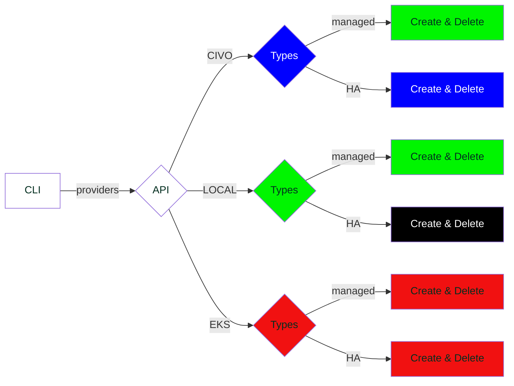

# ksctl

A Kubernetes Distribution that can create clusters as well as high-availability clusters locally as well as on cloud platforms


# Prerequisites

- Docker installed (if using docker container to run the CLI and for Local clusters)

# Supported Platforms

Platform | Status
--|--
Linux | :heavy_check_mark:
macOS | :heavy_check_mark:
Windows | :heavy_check_mark:

# Project Scope

Many cloud providers offer their flavor of Kubernetes. Each provider has its unique CLI tool which is used to create and manage clusters on that particular cloud. When working in a multi-cloud environment, it can get difficult to create and manage so many clusters. ksctl is a **single CLI tool** that can interact with a multitude of cloud providers, making it easy for you to **manage multi-cloud clusters, with just a single CLI tool**. Currently, we support Civo and Local clusters.

You can also use ksctl to create clusters locally using docker.


# Contribution Guidelines
Please refer to our [contribution guide](CONTRIBUTING.md) if you wish to contribute to the project :smile:


# Software Requirement Specification Docs

[Google Doc Link](https://docs.google.com/document/d/1qLGcJly0qWK0dnno6tKXUsm3dd_BpyKl7oi7PLqi6J0/edit?usp=sharing)

# Demo Screenshot
<!-- Add the demo screenshots-->

# Setup CLI (Local)
## Host Machine (LINUX)
### Install
```zsh
make install_linux
```
## Host Machine (macOS)
### Install
```zsh
# macOS on M1
make install_macos

# macOS on INTEL
make install_macos_intel
```

### Uninstall
```zsh
make uninstall
```

# Usage

Please refer to the [usage guide](USAGE.md) to know how you can use ksctl


# RoadMap

## Legends
<span style="color: black; background-color: red;">DONE</span>
<span style="color: white; background-color: black;">NO PLANS</span>
<span style="color: white; background-color: blue;">BACKLOG</span>



