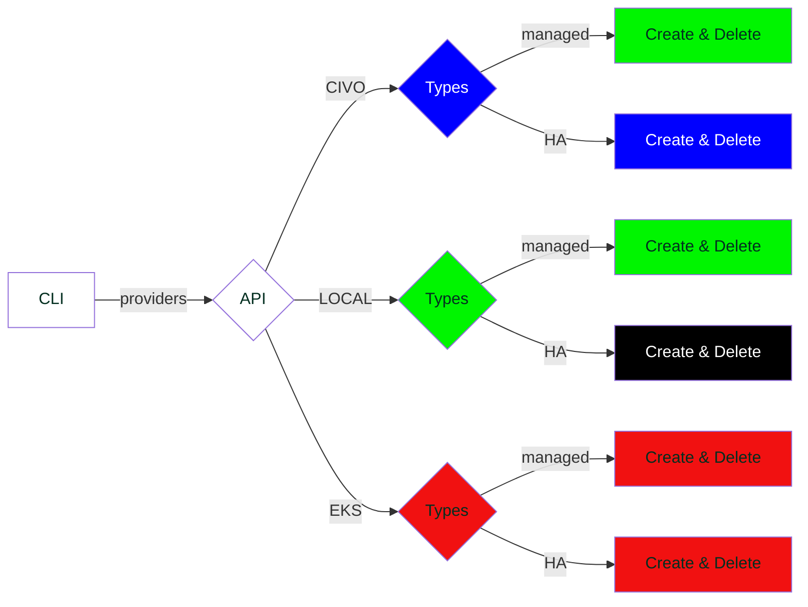

# ksctl

A Kubernetes Distribution that can create clusters as well as High-Available clusters in local as well as on cloud platforms


# Prerequisites

- Docker installed (if using docker container to run the CLI and for Local clusters)

# Supported Platforms

Platform | Status
--|--
Linux | :heavy_check_mark:
macOS | :heavy_check_mark:
Windows | :heavy_check_mark:

# Project Scope

User of Kubernetes wanting a single CLI to manage any K8s cluster be it local to cloud-hosted

# Contribution Guidelines
[contribution Guide](CONTRIBUTING.md)

# Software Requirement Specification Docs

[Google Doc Link](https://docs.google.com/document/d/1qLGcJly0qWK0dnno6tKXUsm3dd_BpyKl7oi7PLqi6J0/edit?usp=sharing)

# Demo Screenshot
<!-- Add the demo screenshots-->

# Setup CLI (Local)
## Host Machine (LINUX)
### Install
```zsh
make install_linux
```
## Host Machine (macOS)
### Install
```zsh
# macOS on M1
make install_macos

# macOS on INTEL
make install_macos_intel
```

### Uninstall
```zsh
make uninstall
```

# RoadMap

## Legends
<span style="color: black; background-color: red;">DONE</span>
<span style="color: white; background-color: black;">NO PLANS</span>
<span style="color: white; background-color: blue;">BACKLOG</span>


