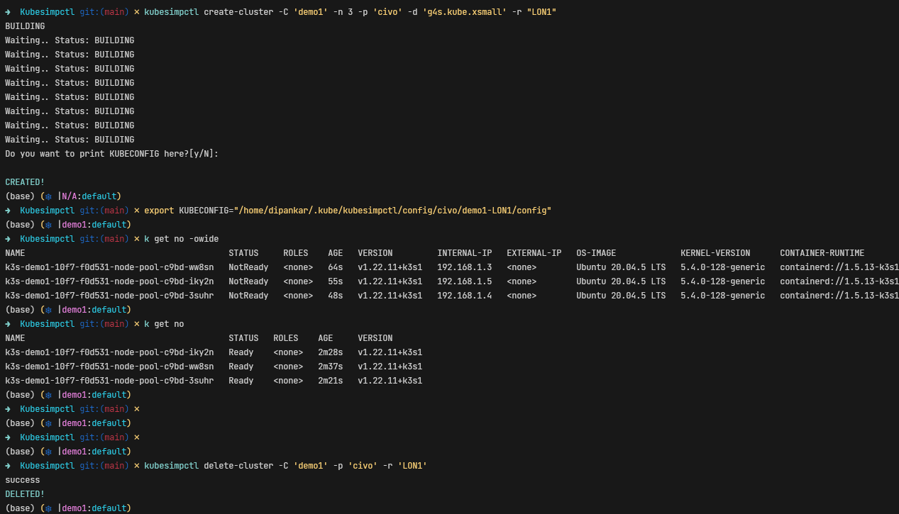

# ksctl

A Kubernetes Distribution that can create clusters as well as High-Available clusters in local as well as on cloud platforms

# Prerequisites

- Docker installed (if using docker container to run the CLI and for Local clusters)

# Supported Platforms

Platform | Status
--|--
Linux | :heavy_check_mark:
macOS | :wrench:

# Project Scope

User of Kubernetes wanting a single CLI to manage any K8s cluster be it local to cloud-hosted  

# Contribution Guidelines
[contribution Guide](CONTRIBUTION-GUIDE.md)

# Software Requirement Specification Docs

[Google Doc Link](https://docs.google.com/document/d/1qLGcJly0qWK0dnno6tKXUsm3dd_BpyKl7oi7PLqi6J0/edit?usp=sharing)

# Demo Screenshot



# Setup CLI (Local)
## How to install
```zsh
make install-linux
```

## How to uninstall

```zsh
make uninstall-linux
```

# Setup CLI (Docker)
## How to install

> **Todo**
> Local cluster cannot be created in docker container

```zsh
cd build/
docker build -f Dockerfile -t abc ../src/cli
docker run -it --rm abc bash
```

## How to uninstall

```zsh
docker rm -f abc
docker rmi abc
```
