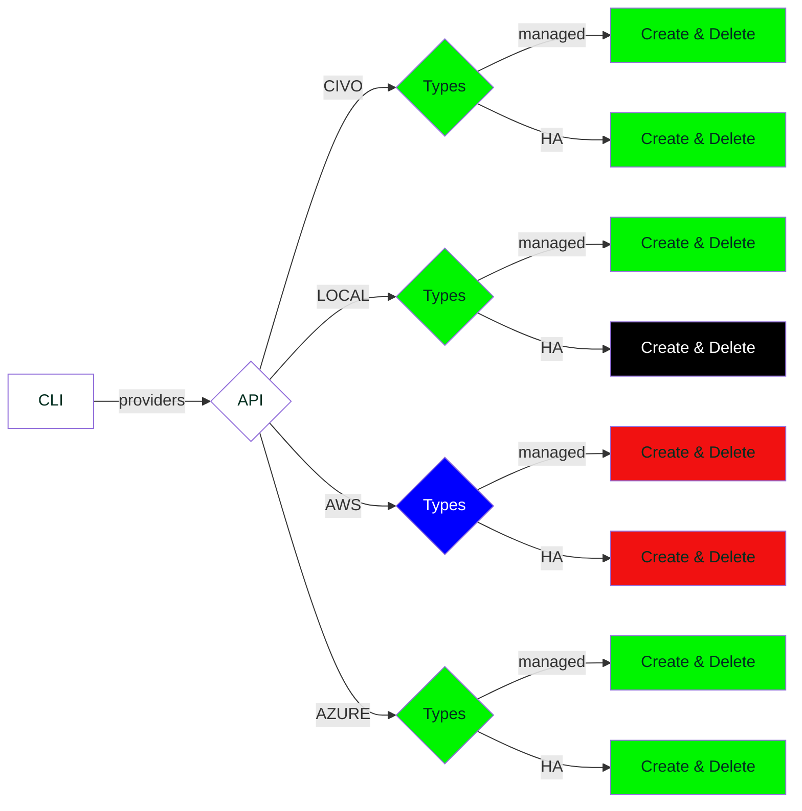

# ksctl Intro

## Purpose
:::info what is it?
The ksctl project by kubesimplify is a command-line tool that helps developers manage Kubernetes clusters running on different enviroment

It provides a simple and intuitive interface for performing common tasks such as creating, deleting, and managing Kubernetes resources. ksctl is designed to be easy to use, even for developers who are new to Kubernetes.
:::

:::success Fact!
ksctl takes **< 15 minutes** to create a cluster
:::

:::note Benefits of using

- **Simple and intuitive interface**: ksctl provides a simple and intuitive interface for managing Kubernetes clusters. This makes it easy for developers to get started with Kubernetes, even if they are new to the platform.
- **Efficient**: ksctl is designed to be efficient. It uses the SDKs to perform operations, which means that it can perform tasks quickly and without the need for additional tools.
- **Powerful**: ksctl is a powerful tool that can be used to perform a wide range of tasks. It can be used to create, delete, and manage Kubernetes resources
- **Lightweight**: ksctl binary is **< 10Mb** in size

Overall, ksctl is a valuable tool for developers who want to manage Kubernetes clusters. It is easy to use, efficient, and powerful.
:::

:::success Purposes of the ksctl project

1. To provide a simple and intuitive interface for managing Kubernetes clusters.
2. To make it easy for developers to get started with Kubernetes, even if they are new to the platform.
3. To improve the efficiency of Kubernetes cluster management.
4. More features and support for Kubernetes cluster management comming soon!
:::

## Current Status on Supported Providers

export const Highlight = ({children, color}) => (
  
    {children}
  
);

<Highlight color="green">Done</Highlight> <Highlight color="red">Not Started</Highlight> <Highlight color="black">No Plans</Highlight> <Highlight color="blue">Backlog</Highlight>

## Current Features

Having core features of `get`, `create`, `delete`, `add nodes`, `switch`, under specific providers

- Local
    - kind cluster with specific version
- Civo
    - have support for the managed and High Availability Cluster(_Custom_)
- Azure
    - have support for the managed and High Availability Cluster(_Custom_)

## Future Plans
- add Web client
- GCP
- AWS
- additional kubernetes application support
- all other cloud providers
- improve the High avilability cluster architecture
- improve logging in local

## Issues and current work
- work on improving the testing
- look for labels `#priority/essential`, `#priority/should_have` and `#kind/bug`

## Current Releases

- [ ] 1.0
- [x] 1.0-rc2
- [x] 1.0-rc1
- [x] ...
