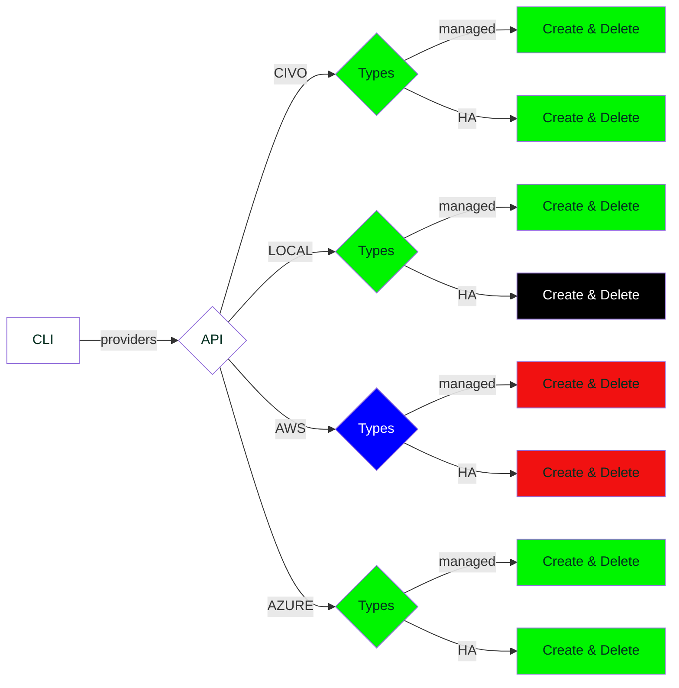

# ksctl Intro

It's a CLI tool which can manage Kubernetes cluster running on different environment(cloud platforms)

**ksctl takes less than 15 minutes**.

## Getting Started

Lets start to understand things better

## Current Status on Supported Providers

export const Highlight = ({children, color}) => (
  
    {children}
  
);

<Highlight color="green">Done</Highlight> <Highlight color="red">Not Started</Highlight> <Highlight color="black">No Plans</Highlight> <Highlight color="blue">Backlog</Highlight>

## Current Features

Having core features of `get`, `create`, `delete`, `add nodes`, `switch`, under specific providers

- Local
    - kind cluster with specific version
- Civo
    - have support for the managed and High Available clusters(_Custom_)
- Azure
    - have support for the managed and High Available clusters(_Custom_)

## Future Plans
- add Web client
- GCP
- AWS
- additional kubernetes application support
- all other cloud providers
- improve the High avilability cluster architecture
- improve logging in local

## Issues and current work
- work on improving the testing
- look for labels `#priority/essential`, `#priority/should_have` and `#kind/bug`

## Current Releases

- [ ] 1.0
- [x] 1.0-rc2
- [x] 1.0-rc1
- [x] ...
